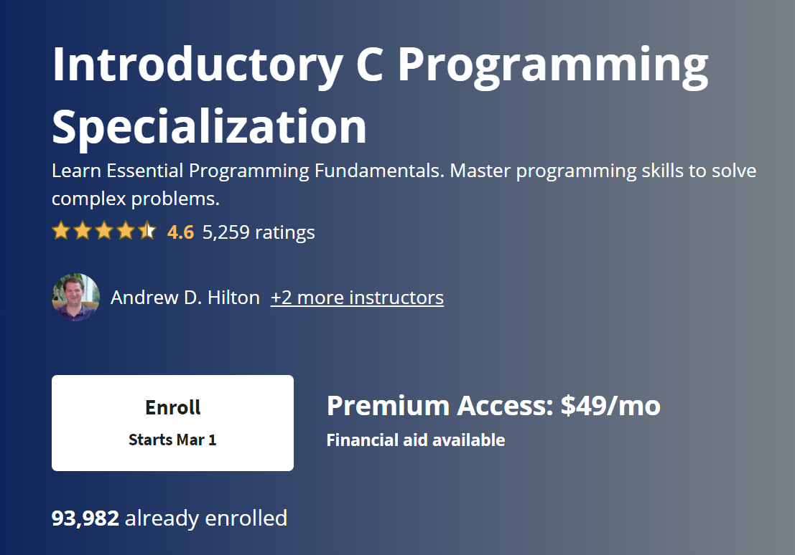
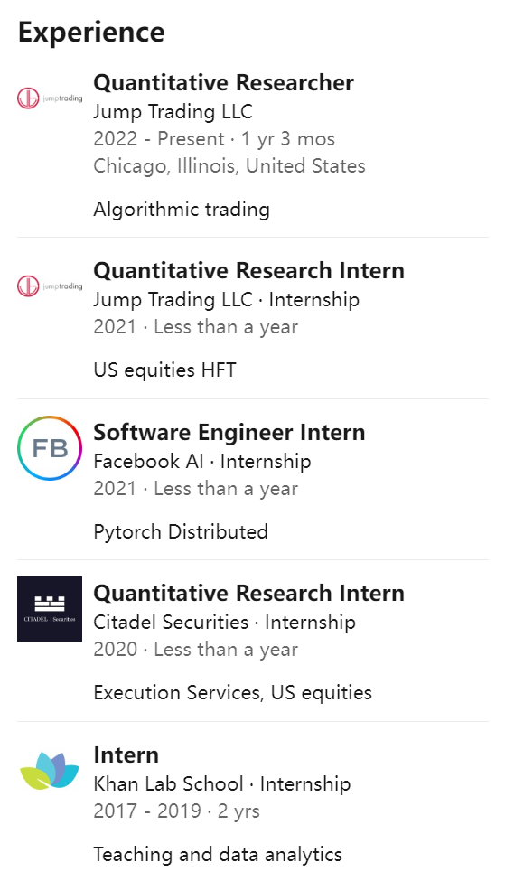
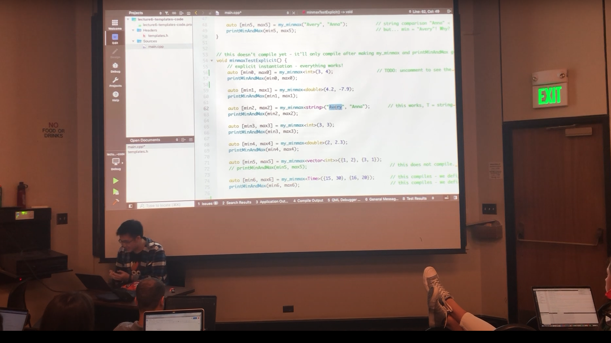
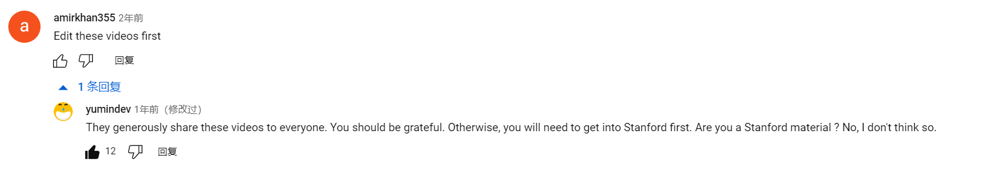
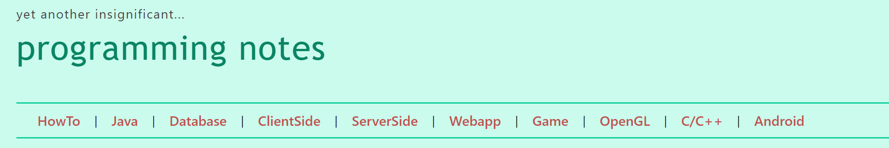

# C++ 自学总结

## 学习路径

Duke Introdutory C Programming -> Stanford CS106L(standard C++ programming) -> NTU programming notes -> AUT AP1400-2

## 课程介绍

### Introductory C Programming Specialization

- 学习时间：一周

- 课程内容：这门课是Duke在Coursera上开设的C语言课程，内容大致为C小程+C大程（去除古色古香的图形库作业）+ gcc、Makefile，valgrind，gdb等关于C语言应该掌握但三本并未提及的重要内容

这门课虽然不免费，但是可以旁听，就是没有课程的完成证书（该证书可以放领英上，不过不知道有没有用🤡）；但是可以申请助学金，申请助学金后课程就是免费的，完成课程后能拿个证书😇申请助学金的审批流程要14天，所以想申请的话要提早。

课程分为4个部分，前面讲的是C的基础语法，之后开始讲gcc等关于编译的内容以及gdb，valgrind等debug的内容

总的来说，课程质量还是非常不错的，很适合来巩固C语言，并且系统地去拓展相关知识。Coursera的课程相较于一般的大学公开课更加interactive，每一个小节都有相应的exercise来复习，但是他的exercise并不能跳着做，所以笔者就不做了🤡

### CS106L

- 学习时间： 刷课一周，复习4天
- 课程内容：CS106L是Stanford开设的C++语言课程，主要介绍了C++的现代特性，在基础语法上并不花时间，所以需要有一定的语言基础。CS106L是CS106B/CS106X的companion class，CS106B是以C++为基础的计算机导论课，讲了一些数据结构（？，笔者没上过，有误请指正😇），只讲一些的C++，所以CS106L可以被视为一门正儿八经的语言课，而106b/x更多关注于语言以外的内容。
- 适合学生：没有其他的语言基础的话学起来会相对更吃力一点，推荐有其他类C语言基础的同学上。Java和C++还是挺像的，class，operator，inheritance等部分和Java基本一致，只不过在语法上有所出入；Python的话和C like的语言就差异比较大了😥学习C++之前还是建议学一学C，一些比较low level的部分基本与C一致
- Instructor介绍： CS106L的讲师并非教授，而是来自湾湾的Stanford本校学生Avery Wang，是个巨佬。好像还修了CS和数学的双学位orz

现在在Jump Trading，笔者所知的大佬云集地（~~Jump打钱！~~）此外，Avery Wang的高中是Taipei American school，和IOI第一的[William Lin](https://www.youtube.com/@tmwilliamlin168)是校友（~~可以follow一下，还和笔者同岁🤡~~） 私货结束🤡    回到教学水平，Avery Wang讲得还是非常非常不错的，虽然是湾湾人，但他的英语还是非常native的，听起来很不戳；此外，这门课的另一位Instructor是个女生，也非常nice，但是名字一时半会找不到了🤡（~~对不起~~）小姐姐的笑声很有感染力🥰🥰

- 课程感受： CS106L是直接录屏课堂，笔者也是第一次体验世界一流大学的线下课堂。课堂有非常非常非常多的Instructor和student之间的交流，基本上课堂里三分之一以上的时间都是在解答学生的疑问，而且提的问题质量也很高，讲解的也很好。课堂的氛围是真的轻松自在，提问极其活跃，从不点名，上课随意进出，甚至还能看到翘脚的学生😇

​	“great question！”，“awesome！”，每一个问题提出后必然得到积极的回应。CS106L给了鼠鼠极大的顶校震撼，我想这样的课根本不需要用点名来束缚学生留在课堂上，毕竟和三本的降智课程已然是云泥之别，顺便我一定要问候一下点名制度的创建者：始作俑者，其有后乎？

- 一丢丢的课程可提升部分：虽然内容很棒，但相比于笔者上过的UC Berkeley的网课，106L有很多的slides并未开放，视频本身有一点点缺陷，比如有些课只有video（课堂录像）或只有screencast（电脑录屏），笔者个人更喜欢screencast，同时有些视频并未剪辑，需手动跳过。但是，这仅仅是笔者的愚见，Stanford愿意将它宝贵的课程资源放到网上，愿意把Stanford学生需要花20万刀才能上的课给普罗大众，我们就应抱以极大的感激之情。图为106L的评论区
- HW部分： 据写过的老哥们说HW质量可能不是很高，笔者的HW1配环境配了半天最后还是配不出来，所以做了一半就跑路了🤡 仅说我做的HW1部分，要实现一个WikiRacer，但第一部分其实只写了十几行代码，用几个STL函数；事实上，WikiRacer这个HW有个更好的升级版，是UC Berkeley的CS61B中的[HW 4: 8 Puzzle | CS 61B Spring 2018](https://sp18.datastructur.es/materials/hw/hw4/hw4)，实现的是一个Puzzle Solver，是我印象比较深的一个HW，把graph的算法和实际问题结合在了一起，同时这个solver是generic的，即可以解决任何问题，本质上和106L的HW1是一样的。
- 课程学习部分：CS106L的网上资源是比较乱的，有完整一学期的video只有[Stanford CS 106L Fall 2019 Lectures - YouTube](https://www.youtube.com/playlist?list=PLCgD3ws8aVdolCexlz8f3U-RROA0s5jWA)，而其他的课程网站如果23winter，18 winter是没有video的，而且笔者在网上找不到19fall的slides，所以就先用18fall的slides顶替了，但是18fall和19fall授课的顺序和内容有所变化，所以最终还是自己取舍。[CS106L Standard C++ Programming | Learn CS](https://learncs.me/stanford/cs106l)这个网站大致收录了能用的资源，尽量少在找其他学期的资源上耗时间。

### NTU Programming Notes

- website： [yet another insignificant Programming Notes (ntu.edu.sg)](https://www3.ntu.edu.sg/home/ehchua/programming/index.html)   好吧这个网站的名字不是那么直观🤡

- 学习时间：C++部分  一周
- 内容介绍：笔者之前没有接触过坡县大学的学习材料，找到这个programming notes是偶然间发现的，可能是因为有时候把节点开到坡县了🤡这个Notes是NTU的教授[Chua Hock Chuan | Academic Profile | DR-NTU | Research | NTU Singapore](https://dr.ntu.edu.sg/cris/rp/rp00469) 但是，这个notes非常好，不仅仅限于C++的内容，从了解Windows开始到OOP，Java，C++，Web乃至于环境配置，IDE介绍等等皆应有尽有，~~薄纱菜鸟教程~~，内容广，并且非常优质，笔者花了大概一周的时间来看掉C/C++ Programming的部分，对基础语法做了非常详尽的讲解(涉及很少的现代特性，notes写的时间也在十年前，但基础语法部分个人认为也牵扯不上现代特性），如果想要对C++基础语法的练习，可以去[HackerRank](https://www.hackerrank.com/)找C++的题做掉，笔者做了一半，感觉还不错😇

### AUT AP1400-2

- 该课程没有课程主页，只有GitHub上的作业repo：[aut courseworks (github.com)](https://github.com/orgs/courseworks/repositories?page=1)，但已经足够
- 对于106L作业质量不佳的情况，笔者选择去做AUT的AP1400-2，但是这个coursework有一定的门槛，需要一点Docker的知识，看懂Dockerfile即可，但是不会也没事，直接手动build也行，可以加个AP1400-2的交流群，群主很热心，群文件里有环境配置的文档（感谢群主大大🥰🥰) 
- 笔者就不贴自己的Github了，~~以免掉码，极少数认识笔者的8友别揭鼠鼠马甲~~😇。
- 作业质量： 说实话AP1400-2的6个HW是我目前为止做的最舒服的HW，没有很长的spec，~~我做过AP1400-2，那里的coding很纯粹。~~  实现的东西很简洁也常见，但触及到的C++特性却基本上包含了笔者在106L以及Programming notes学到的内容，非常好的上手体验。每个HW需要花的平均时间大致为两到三天（笔者尽量多去写新特性，所以花费的时间可能比大部分人多）
- HW具体内容：
  - 1.HW1相对比较无聊，实现的是一个algebra的库，用到的基本上都是线代的知识，虽然笔者做完了HW1，但还是只建议做HW1的一半，做一半大概就能熟悉了大致的实现过程，剩下的基本就是数学的加加减减
  - 2.HW2实现的是一个中心化的加密货币交易过程，里面一些概念相对比较难理解，但是基本上实现的东西还是不难的，最后一个mine的部分spec描述的不清楚，交流群的老哥也没去实现
  - 3.HW3实现的是一个BST，可能是笔者学DS过的时间比较久，写的比较磕磕绊绊，当然也可能是因为C++的memory allocation比较麻烦，笔者之前用Java实现的时候比较顺畅。虽然如此，但HW3是笔者收获最多的一个HW，个人认为最值得一做
  - 4.HW4实现的是uniquePtr和sharedPtr，接触的是template class,比较简单，UniquePtr和SharedPtr有非常多相似之处
  - 5.HW5接触的是继承和多态，应该是6个HW里最简单的，几个小时就可以做完
  - 6.HW6是用STL来解决四个问题，第一个问题接触到的functor很不错

### 结语

C++语言：笔者对C++的理解不深，但总的来说C++的memory allocation比较麻烦，特性也很多，当然这可能也是很多人觉得C++难写的原因。

课程部分： 有的时候会很感慨，好像随便Google找个课程都能薄纱三本大部分课程，很希望在不久的将来，能不出国门，乃至不出校门也可以上到对得起QS50的课程

